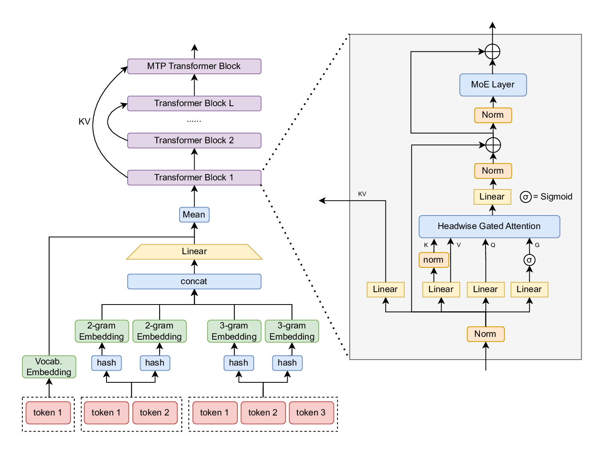
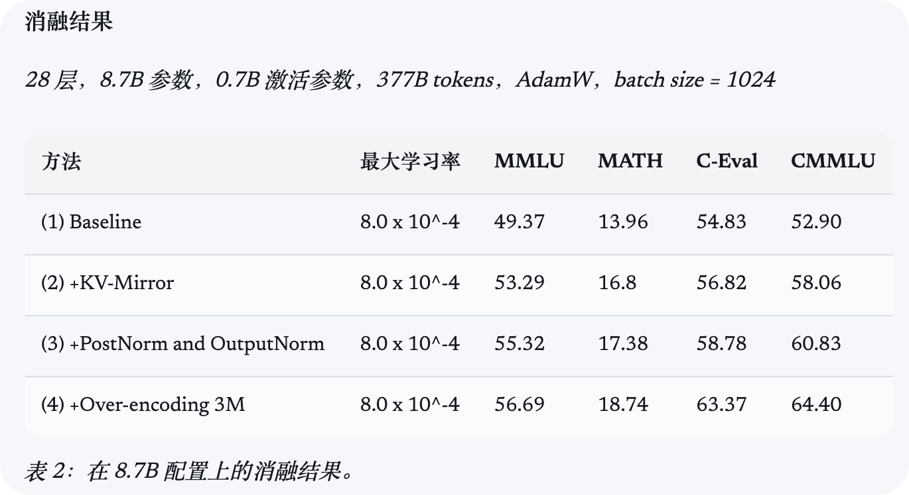

# WeLM：以适度资源构建高效稀疏 MoE 模型 - 技术总结

[Link](https://welm.weixin.qq.com/posts/building-effective-sparse-moe-models-with-moderate-resources/)

## 核心贡献与背景

微信 AI 团队在计算资源受限（不足 14T tokens）的条件下，成功训练出性能极具竞争力的 80B 及 130B 稀疏 MoE（混合专家）大语言模型。该模型通过一系列精细的架构魔改与极致的底层显存/通信优化，实现了训练与推理阶段的“降本增效”。

## 1. 架构创新 (Architecture)

模型在标准 Decoder-only 架构上进行了大量旨在**降显存、提速度、稳训练**的微创手术：

### 1.1 MoE 路由与专家设计

* **Loss-free Balance Routing (无损均衡路由)**：在不引入额外辅助损失（Auxiliary Loss）干扰主任务的前提下，实现专家负载均衡。
* **未归一化的 Sigmoid Gate**：摒弃 Softmax，改用 Sigmoid 对每个专家独立打分，提升路由机制的表达能力与灵活性。
* **共享专家 (Shared Expert)**：设置 1 个共享专家处理所有 Token 的通用知识，其余路由专家专注垂直领域，减少知识冗余。

### 1.2 注意力机制与 KV 缓存管理

* **KV-Mirror (KV 镜像)**：采用 U 形共享策略，**深层网络不直接计算完整的 KV，而是读取对应浅层网络在 K/V 投影前的 Hidden States，并用深层自身的权重进行投影**。此举不仅在 Prefill 阶段降低推理成本、支持计算早退出，且在消融实验中证明能有效提升模型泛化分数。
* **3 倍 Attention Head + Head-wise Gating**：激进扩大 Head 数量以提升特征捕捉上限，同时引入基于 Sigmoid 的门控机制（），动态抑制对当前 Token 无效的 Head 噪声。
* **GQA 与 Partial RoPE**：结合 Grouped-Query Attention 与部分维度旋转位置编码，进一步优化推理显存与长文本外推性。
* **KNorm**：在 Key 投影后引入归一化，稳定 Attention Logits。

### 1.3 输入与输出层增强

* **Over-encoding (2-head 超编码)**：利用多头哈希 (Multi-head Hashing) 机制，在不增加物理参数显存占用的前提下，将 N-gram (短语) 融合进输入表示中，降低训练 Loss。
* **Multi-Token Prediction (MTP)**：额外添加一层 MoE 作为 MTP 层，在训练时预测多个后续 Token，以支持推理阶段的投机采样 (Speculative Decoding)。

### 1.4 训练稳定性控制

* 结合 **Partial PostNorm** (MoE 前仅归一化输入；Attention 前归一化输入与残差) 与 **OutputNorm** (稳定 Attention 输出)，有效缓解深层网络的梯度异常放大与表示崩溃问题。

---

## 2. 训练策略与数据工程 (Training & Data)

* **AI 辅助数据清洗**：使用基于 LLM 的 Quality Grader 进行高质量数据打分过滤，并创新性地引入 VLM (Vision-Language Model) 替代传统 OCR，从 PDF 中提取干净的学术与文档数据。
* **优化器选择**：采用 **Muon** 优化器替代传统的 AdamW，在大批量训练中获得更好的收敛效率。
* **Depth Up-Scaling (深度扩展)**：WeLM-130B 变体并非从零训练，而是截取完成 13.7T tokens 训练的 80B 基座模型，**将其“中间三分之一的层循环复制两次”** 构建而成。随后仅需在低学习率下进行少量追加训练，即可实现性能的飞跃。

---

## 3. 底层基础设施优化 (Infrastructure)

为了在中等规模集群上突破“内存墙”与“通信墙”，WeLM 实现了极致的算子与显存调度：

* **通信掩盖**：引入 **DualPipeV** 与 **DeepEP**，将专家并行中的网络通信与 GPU 计算重叠，有效消除通信气泡。
* **Kernel 算子融合**：
* 实现 **Grouped GEMM**，合并所有专家的矩阵乘法，大幅减轻 CPU 端的 Kernel 启动开销。
* 将 Norm 与 RoPE 融合为单一轻量级算子，降低显存访问延迟。

* **激活显存榨干 (Activation Memory Optimization)**：
* **融合 Unpermuting 与 SwiGLU**：在 MoE 计算中，将反置换 (Unpermuting) 操作后移至激活函数计算之后，并融合为一个 Kernel。这使得庞大的中间张量得以快速释放，并在反向传播中通过重计算 (Recomputation) 恢复，极其显著地降低了激活显存开销。
* 策略性应用 FP8 量化与选择性激活检查点 (Activation Checkpoints)。
## 4. 核心评测表现 (Evaluation Results)
在多项公共基准测试中，WeLM 模型展现出了极强的“越级”竞争能力。特别是在有限激活参数（Activation Parameters）的约束下，其整体表现优于或匹敌同等规模的开源 SOTA 模型。

以下是部分核心英文与推理任务的成绩对比（均在相同评测流水线下完成）：

| 评测基准 (Benchmark) | WeLM 80B-A3B | WeLM 130B-A4.9B | Qwen3-Next 80B-A3B | GLM-4.5 Air |
| :--- | :--- | :--- | :--- | :--- |
| **MMLU** (英文综合) | 85.65 | **86.91** | 84.72 | 80.61 |
| **BBH** (复杂推理) | 85.47 | **88.05** | 87.13 | 82.28 |
| **MATH** (困难数学) | 60.04 | 58.78 | 62.36 | **65.63** |
| **GSM8K** (小学数学) | 87.72 | **90.90** | 90.30 | 86.20 |

*注：数据提取自公共基准 5-shot 或 CoT 评测。*

**评测结论摘要：**
* **极致的参数性价比**：WeLM-80B 在仅激活 3B 参数的情况下，MMLU 综合能力（85.65）超越了同样激活 3B 的 Qwen3-Next 80B。
* **Depth Up-Scaling 的有效性**：通过层复制技术快速拉宽的 130B 模型，在逻辑推理（BBH、GSM8K）和通用理解上均获得了立竿见影的性能拔高。

## 5. 总结与启发 (Conclusion & Takeaways)

WeLM 的技术实践打破了“大模型只能靠暴力堆算力”的刻板印象，展示了在中等资源规模下，通过深度的**算法与系统协同设计 (Algorithm-System Co-design)** 依然能炼出顶尖模型的可能性。

* **算法层面的精打细算**：从 KV-Mirror 的隐藏状态复用，到 Over-encoding 的多头哈希词表，再到 Head-wise Gating 的动态稀疏注意力，WeLM 的核心设计哲学是**“拒绝冗余计算，只在刀刃上分配参数与算力”**。这对于当前致力于高效长上下文推理和 KV Cache 压缩优化的研究具有极大的参考价值——证明了在保留核心语义映射（如深层的独有 $W_k, W_v$）的前提下，底层结构的重组能带来巨大的显存与速度红利。
* **工程层面的极致压榨**：大模型的瓶颈往往在内存墙和通信墙。WeLM 团队通过 DeepEP 和 DualPipeV 彻底掩盖了 MoE 的通信气泡，并通过极致的算子融合（尤其是将 Unpermuting 与 SwiGLU 融合以提早释放激活显存）将 GPU 的利用率推向了物理极限。
* **训练策略的“讨巧”**：利用 Depth Up-Scaling 这种“走捷径”的层复制技术进行模型扩展，配合基于 LLM/VLM 的高质量数据清洗流水线，用极少的追加训练成本就实现了从 80B 到 130B 的能力跃升。

总而言之，WeLM 并非单纯的参数堆砌，而是提供了一套极具实操价值的高效大模型架构“军火库”。它为计算预算受限的学术探索和工业落地指明了一条“以精巧架构换取算力”的极佳路径。